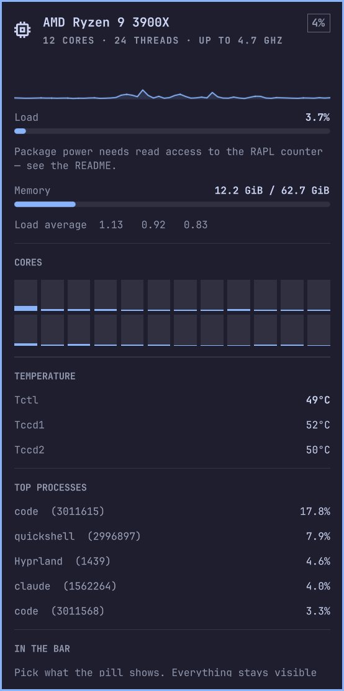

# CPU

Load, temperature and clock in the [Omarchy](https://omarchy.org/) bar, and
a fuller picture one click away.

The pill shows what you pick — load, temperature, clock — and recolours
itself as the machine gets busy. The panel adds a load graph, a bar per
hardware thread, every CPU temperature sensor the kernel exposes, and the
processes actually burning the cycles.

Everything is read from `/proc` and `/sys`. No daemon, no root, no polling
anything off this machine.




## Install

```bash
omarchy plugin add https://github.com/DanSmith888/omarchy-cpu.git --enable
```

### Check it

```bash
~/.config/omarchy/plugins/dansmith888.cpu/bin/cpuctl doctor
```

Verifies every link from `/proc` to the bar and tells you how to fix
whatever is broken.

## Update

```bash
omarchy plugin update dansmith888.cpu && omarchy restart shell
```

## Remove

```bash
omarchy plugin remove dansmith888.cpu
```

That removes everything. The plugin never touches anything outside its own
folder and two files in `$XDG_RUNTIME_DIR`.

## Using it

**Left-click** the pill to open the panel. **Middle-click** opens `btop`,
reusing an existing btop window rather than stacking up terminals. **Hover**
for the model and full readings. Esc closes. To open the panel from a
hotkey:

```bash
omarchy-shell shell toggle dansmith888.cpu
```

## What it shows

| Section | What's in it |
|---|---|
| **Hero** | Model, core and thread count, top clock, current load |
| **Graph** | Recent load, 30–240 samples |
| **Load / Memory** | Total CPU load and used RAM, with the 1/5/15 load average underneath |
| **Cores** | One bar per hardware thread; hover for the number |
| **Temperature** | Every label the CPU's hwmon reports (Tctl, Tccd1, …), headline one in bold |
| **Top processes** | Busiest processes since the last sample, as a share of one core — four cores busy reads 400%, like `top` |
| **In the bar** | Which readings the pill shows, refresh rate, °C/°F, graph history |
| **Power** | Package watts when the energy counter is readable — optional, see below |
| **Layout** | Pin the pill to a fixed width, or leave it to size itself |
| **Warning & alert** | Two thresholds and a color each, taken from your live Omarchy theme; the pill, hero mark and core bars follow them |

Settings are stored inline on the widget's `~/.config/omarchy/shell.json`
entry and apply immediately.

## Requirements

- Omarchy (Quattro or later)
- Linux with `/proc` mounted — that's it
- `btop`, only for the middle-click shortcut


Temperatures come from `k10temp`, `zenpower`, `coretemp`, `cpu_thermal` or
`acpitz`, whichever is present, with thermal zones as a fallback. Machines
with no CPU hwmon simply hide that section. The clock is the average of the
per-policy `scaling_cur_freq` values, falling back to `/proc/cpuinfo`.

## Command line

```
cpuctl get [--json]        load, per-core, temperatures, clock, memory, top
cpuctl top [--json] [-n N] busiest processes since the previous sample
cpuctl doctor              check every link from /proc to the bar
```

## Good to know

- Load is a delta between two samples. The first reading after a boot or a
  long gap takes a 0.25 s second sample so it still means something.
- Process percentages follow the `top` convention: a share of one core, so a
  process using four cores reads 400% and one saturating a 24-thread machine
  reads about 2400%. The **Load** reading is the separate machine-wide
  figure, and is always 0–100%. `cpuctl top` on the command line always reports the one-core figure,
  since that is what the `/proc` deltas measure.
- Used memory follows `MemAvailable`, so reclaimable cache is not counted.
- The pill reserves the width of its widest reading (`100% 100° 9.9GHz`),
  so nothing in the bar shifts as digits come and go.
- The warning and alert thresholds were once called busy and hot; an
  existing bar entry keeps its old `busyFrom`/`hotColor` values.

## CPU power

**Entirely optional.** Out of the box there is no power display at all — no
bar, no hover row, nothing in the pill. The plugin never asks for elevated
privileges and works fully without this.

Power comes from the CPU's own energy counter,
`/sys/class/powercap/intel-rapl:*/energy_uj`, which most kernels ship as
`0400 root:root`. Without read access there is nothing to measure, so the
plugin shows nothing rather than guessing — a load-based estimate is wrong by
roughly ten times at idle, since a chip drawing 45 W doing nothing would read
near zero.

`btop` solves this by shipping its binary with a file capability
(`cap_dac_read_search`); a Python script cannot do the same, because the
kernel ignores capabilities on interpreted files.

To grant access, scoped to the `wheel` group rather than world-readable:

```bash
sudo tee /etc/udev/rules.d/99-rapl-readable.rules >/dev/null <<'EOF'
SUBSYSTEM=="powercap", KERNEL=="intel-rapl:*", \
  RUN+="/usr/bin/chgrp wheel /sys%p/energy_uj", \
  RUN+="/usr/bin/chmod g+r /sys%p/energy_uj"
EOF
sudo udevadm trigger --subsystem-match=powercap
```

Check it took, and undo it, with:

```bash
~/.config/omarchy/plugins/dansmith888.cpu/bin/cpuctl doctor | grep -i power
sudo rm /etc/udev/rules.d/99-rapl-readable.rules   # then reboot to undo
```

The reading appears within a poll or two — the first sample after granting
access has nothing to compare against, so it settles on the second.

**Is it safe?** It relaxes a deliberate mitigation. Power readings are a side
channel: the PLATYPUS attack (CVE-2020-8694) recovered AES and RSA keys from
them, which is why the counter is root-only. Granting `wheel` read access is
usually an easy call on a single-user desktop and a poor one on a shared or
multi-user machine. Your decision.

### The total

Once readings work, the bar needs something to measure against. Intel's RAPL
reports its own limit and it is used automatically. **AMD reports none**, so
enter your CPU's **PPT** — Package Power Tracking, the sustained package power
the chip may draw — under Power in the panel. A Ryzen 9 3900X is 142 W PPT
against a 105 W TDP, so use the PPT, not the TDP.

Leave PPT at 0 and the wattage is simply shown on its own, with no bar and no
total.

## What runs, and as whom

Omarchy plugins run inside the shell process, unsandboxed, as your user.
This one runs two Python scripts from its own `bin/` — standard library
only, no extra packages, no binaries, no network, nothing that needs root.
It writes nothing outside its folder except a lock and a sample-state file
in `$XDG_RUNTIME_DIR`.

## Related

One of a trio that share a panel layout, controls and keybinds, so they read
as one thing in the bar:

- [omarchy-cpu](https://github.com/DanSmith888/omarchy-cpu) — load, cores,
  temperature, memory, top processes
- [omarchy-gpu](https://github.com/DanSmith888/omarchy-gpu) — load, VRAM,
  power, sensors, GPU clients
- [omarchy-network](https://github.com/DanSmith888/omarchy-network) —
  download and upload, history graphs, per-app bandwidth

## Credits

The panel borrows its shape from Omarchy's own tailscale and network panels,
and the history graph from
[stappmus.activity-monitor](https://github.com/stappmus/omarchy-activity-monitor).

## Licence

MIT — see [LICENSE](LICENSE).
